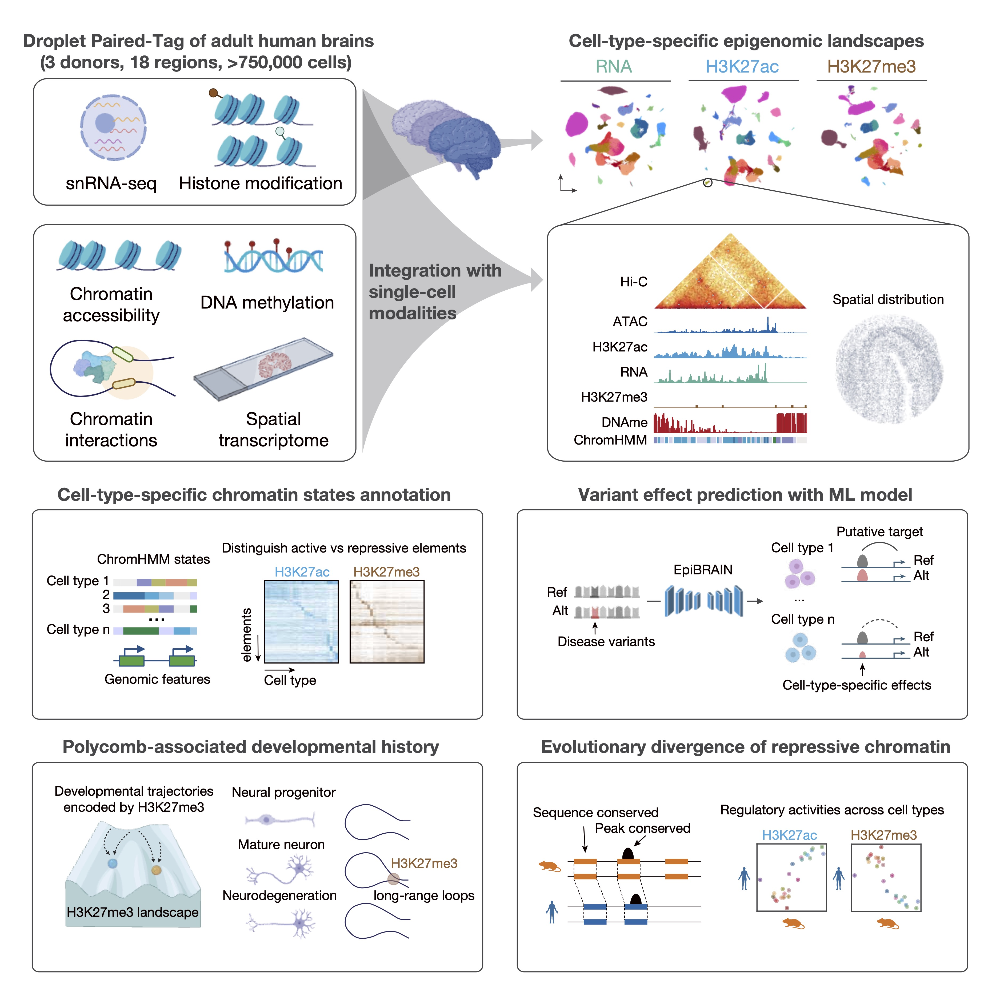

# MiniAtlas 

🥃 This repository contains code to reproduce the analysis for our manuscript: [Single-Cell Multimodal Atlas Reveals Regulatory Programs in the Human Brain](https://www.biorxiv.org/content/10.64898/2026.02.02.703166v1)
  

## Abstract
Direct measurement of chromatin states with transcription is essential for understanding how cell-type-specific regulatory programs are established and maintained in adult human brain. Here, we present a large-scale single-cell multimodal atlas by jointly profiling transcriptome with active (H3K27ac) or repressive (H3K27me3) histone modifications across 18 adult brain regions. We targeted over 750,000 nuclei spanning 160 cell types and integrated these data with chromatin accessibility, DNA methylation, 3D genome architecture and spatial transcriptome. This framework resolved chromatin states for over 500,000 candidate regulatory elements, identified enhancer-gene links and regulatory programs, revealed Polycomb-associated ultra-long-range contacts and uncovered brainwide epigenomic heterogeneity. We further developed sequence-to-function model to predict cell-type-specific effects of candidate neurological disease variants. Finally, comparative analyses across species reveal conservation in active regulatory programs but divergence in repressive programs. Together, this study provides a comprehensive epigenomic reference for interpreting regulatory principles and epigenetic memory underlying human brain organization and disease.

## Highlights
- Single-cell multimodal profiling resolves active and repressed chromatin states in adult human brain.
- Enhancer-gene maps and deep learning model link disease variants to target genes.
- Polycomb repression preserves regional identity and developmental history in brain.
- Active regulation is conserved, but repressive regulation diverges across species.

## Analysis
A step-by-step preprocessing workflow of Droplet Paired-Tag data can be found in `01.pre_process`.
Details step to reproduce the analysis in our manuscript can be found in `02.analysis`.

## Data
- All processed and raw sequencing data are available at NCBI Gene Expression Omnibus (GEO) with accession number [GSE327101](https://www.ncbi.nlm.nih.gov/geo/query/acc.cgi?acc=GSE327101). A public, interactive single-cell genome browser is available at https://miniatlas.nygenome.org/. MERFISH data are available at Brain Image Library (BIL, doi: 10.35077/g.1195). 
